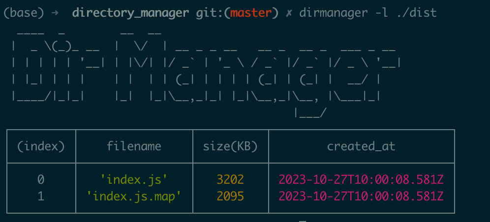
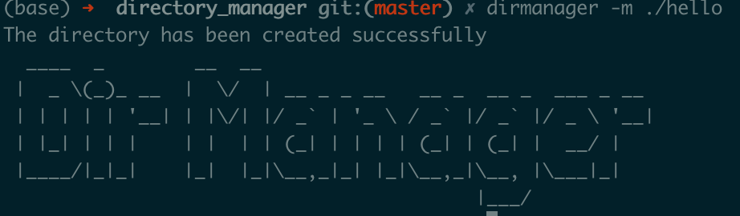
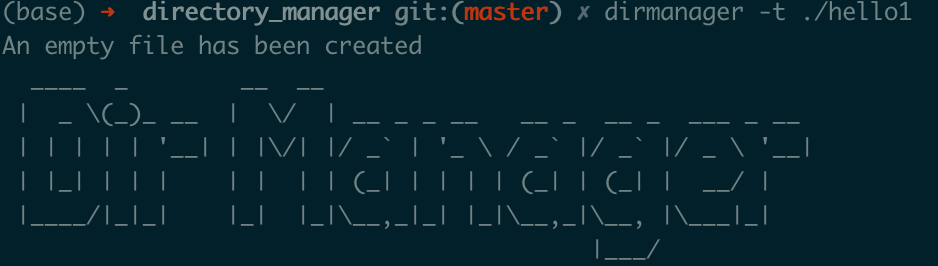

# Directory Manager

> A CLI directory manager that can be used to create directories, list directory contents and create files

## Features

- [x] List directory contents
- [x] Create a directory
- [x] Create a file

## Screenshot





## Install

```bash
npm i @xdebug/directory_manager
```

## Usage

### List directory contents

```bash
dirmanager -l %path%
```

### Create a directory

```bash
dirmanager -m %path%
```

### Create a file

```bash
dirmanager -t %filename%
```
